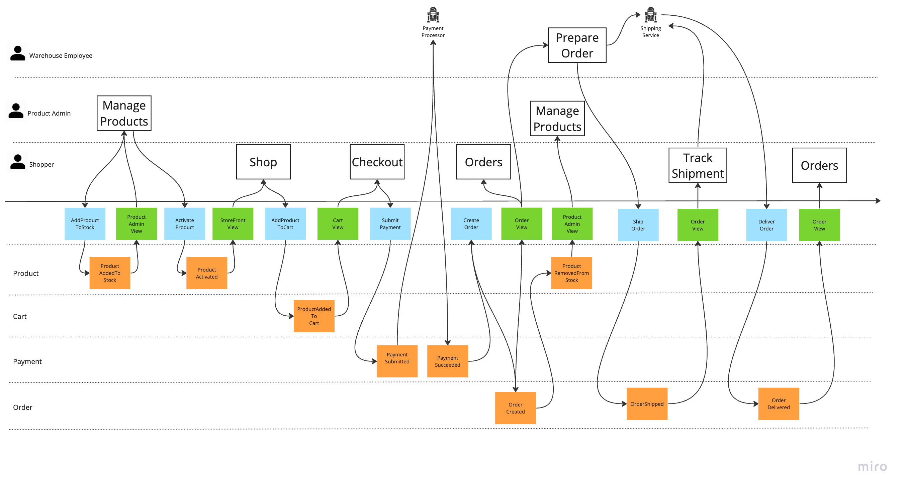

# Monostore

This is an example of an Axon Framework application for a faux shopping experience. Its used solely to exercise examples of Axon Framework. It is not intended to be a real application.

## Running the application

Monostore requires [Axon Server](https://console.cloud.axoniq.io/) and [MongoDB](https://www.mongodb.com/) to run. I recommend using [Mongo Atlas]](https://www.mongodb.com/cloud/atlas) for a cloud-based MongoDB instance. Both Axon Cloud Console and MongoDB Atlas offer free tiers and offer a console for data level visibility into the application.

To run the application, you will need to set the following environment variables:

- `AXON_SERVER_HOST` - The hostname of your Axon Server instance
- `AXON_CONTEXT` - The context for the application. This is used to separate the application from other applications in the same Axon Server instance when using the free tier.
- `AXON_TOKEN` - The token for the application. This is used to authenticate the application with Axon Server when using the free tier. This is created when creating your application binding .
- `MONGO_URI` - The URI for your MongoDB instance. This is used to connect to the database.

Once you have set these environment variables, you can run the application using the following command:

```shell
./gradlew bootRun
```

## Application Design

The design of the application uses Event Modeling and the implementation is done across branches to illustrate one possible way to implement directly from the Event Model. 

The main branch has the Account aggregate (not in the core event model) with a simple create for an Account so we have something to use for the rest as well as the first "chunk" of the Product aggregate.



The first "chunk" is the initial Manage Products API call that ends with updating the ProductAdminView.

This will be the pattern for all other branches, implementing a simple "loop" from a user (or automation) command to 
the view or views that are updated as a result of the command.

